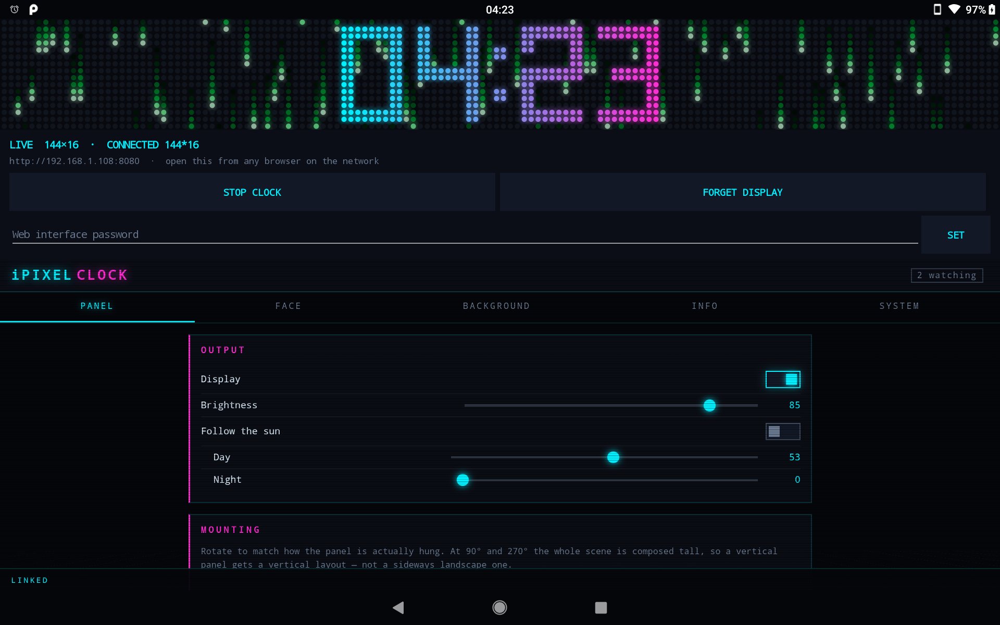
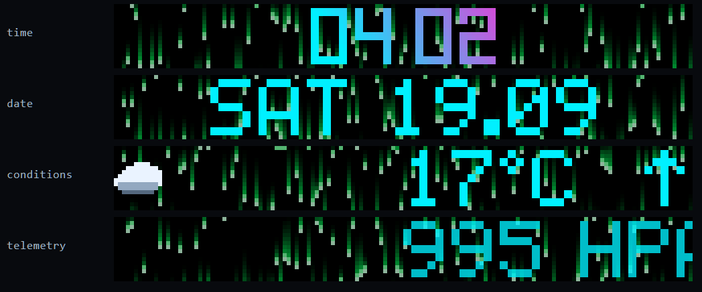
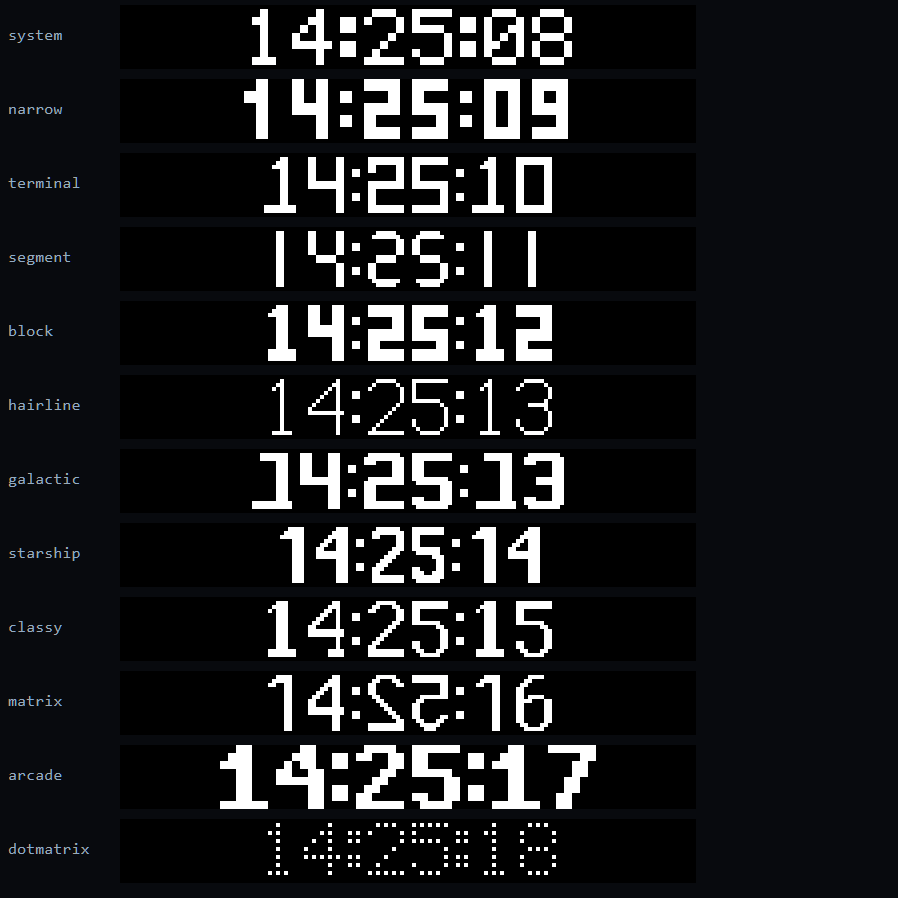
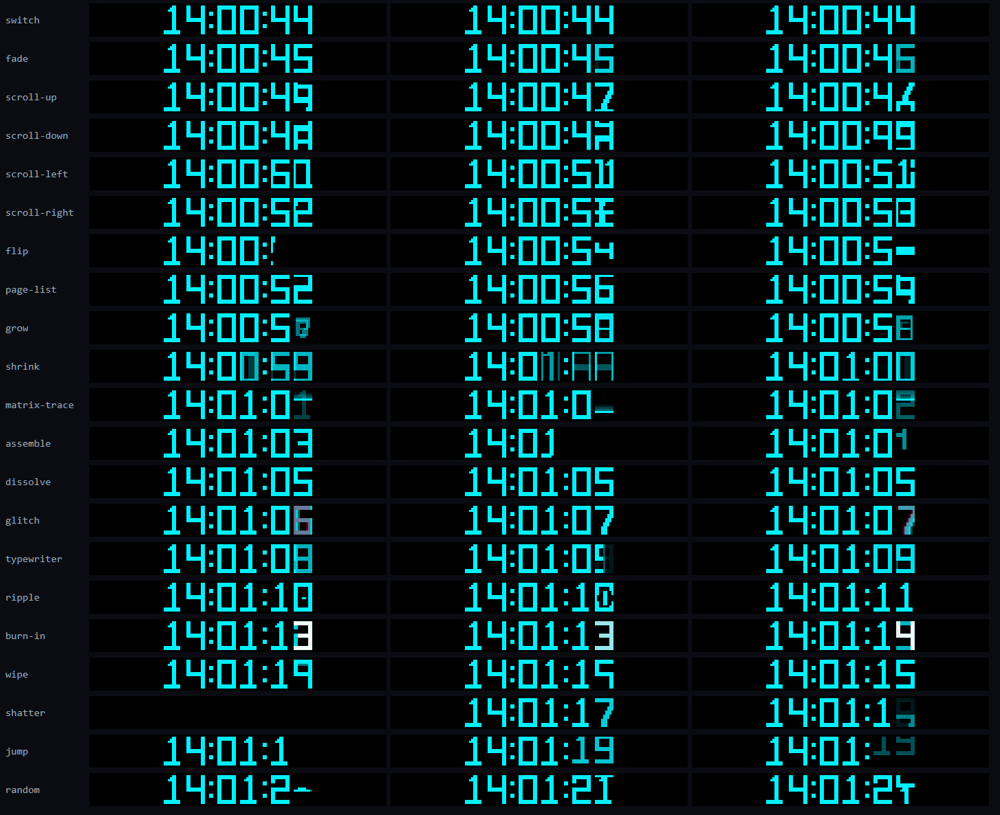
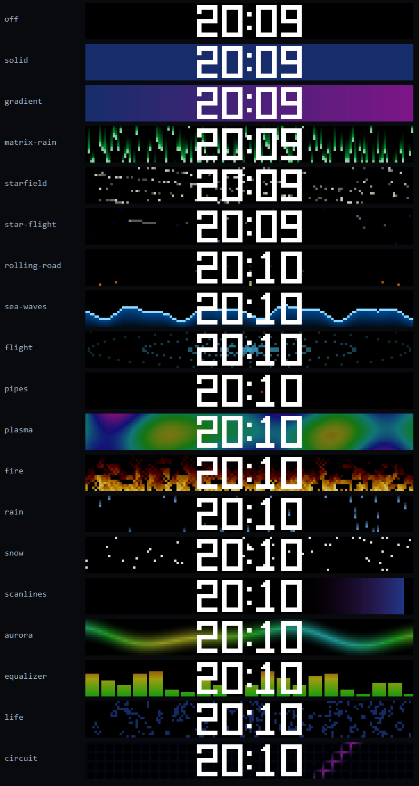
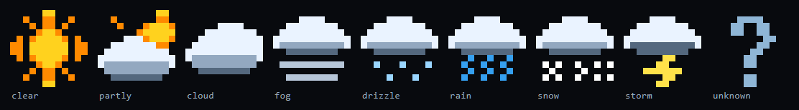

# iPixel Clock

Turn an **iPixel BLE LED matrix** into a clock worth looking at — driven by an
Android phone, configured from the phone itself or from any browser on your
network.



A background service keeps the panel lit with the screen off and the app swiped
away. Everything else — twelve bitmap fonts, twenty-one digit-change effects,
nineteen generated backgrounds, weather, date and sun times — is configured
through a single interface that is written once and served by the app, so the
phone and a laptop browser show exactly the same controls.

**No panel is required to try it.** The app installs, runs, previews and
configures on a bare phone with Bluetooth switched off. It renders to a
simulated panel and shows you precisely what would be on the wall. You need real
hardware for real light, and the app says so rather than pretending.

---

## Run it

No Android Studio, no SDK setup, nothing to install by hand. Open a terminal in
the project folder and run three things in order.

### Windows

1. **`download-tools.cmd`** — once per machine. Downloads the JDK, the Android
   SDK and Gradle into `tools\`; anything you already have is reused instead.
   Takes a few minutes the first time, seconds ever after.
2. **`build.cmd`** — builds the app. The APK lands in
   `out\ipixel-clock-debug.apk`.
3. **`build.cmd --install`** — deploys it to the phone: plug it in over USB,
   enable USB debugging, accept the prompt on the phone, run this.

### Linux / macOS

1. **`./download-tools.sh`** — once per machine. Downloads the JDK, the Android
   SDK and Gradle into `tools/`; anything you already have is reused instead.
   Needs `curl` and `unzip`.
2. **`./build.sh`** — builds the app. The APK lands in
   `out/ipixel-clock-debug.apk`.
3. **`./build.sh --install`** — deploys it to the phone: plug it in over USB,
   enable USB debugging, accept the prompt on the phone, run this.

No phone cable handy? Copy `out/ipixel-clock-debug.apk` to the device and tap
it, or download the prebuilt APK from [Releases](../../releases). Options,
release builds and signing are under [Building](#building).

Then see [Getting started](#getting-started) for the first run.

---

## What it looks like

The panel rotates between the time and a few readouts. Everything below is
captured off a real 144×16 panel.



### Twelve fonts

All original designs, drawn pixel by pixel. The named inspirations are
trademarked typefaces, so nothing is traced and no font file ships in the APK.



### Twenty-one digit-change effects

Run per character cell, so 13:59 → 14:00 animates the three digits that changed
and leaves the one that did not alone.



### Nineteen backgrounds



### Weather icons



---

## Getting started

1. Install the APK — [Run it](#run-it) builds one, or take a prebuilt one from
   [Releases](../../releases).
2. Open the app and set a **web password** — one field at the top. Until you do,
   the web interface refuses every remote browser.
3. Press **DETECT DISPLAY**. Bluetooth is not touched before this.
4. Open the address the app prints from any browser on the network.

```
http://<phone-ip>:8080
```

### Why not port 80

An unprivileged Android app cannot bind any port below 1024 — the kernel refuses
it, on every Android version, and there is no `setcap` or `authbind` to grant an
exception. The server takes **8080**, then 8000, 8888, the port it last managed
to get, then a random one in 6500–7500. Whatever it lands on is shown in the app
and in the notification.

On a rooted phone you can forward 80 to it yourself, outside the app:

```bash
iptables -t nat -A PREROUTING -p tcp --dport 80 -j REDIRECT --to-port 8080
```

### The password

- Set **only in the app**. One input, no confirmation. A browser session can
  never change it, so getting in once is not enough to lock the owner out.
- Stored as a salted, iterated SHA-256 hash. The plaintext never touches disk.
- **Until a password is set, remote access is refused outright** — the interface
  is closed, not open. It does not fall open on misconfiguration.
- Failed logins are throttled per source address with a growing delay.
- The app's own embedded view comes from `127.0.0.1` and is never asked to log
  in. Note that `adb forward` also presents as loopback.
- Sessions live in memory, so restarting the clock signs everyone out.

---

## Features

| | |
|---|---|
| **Panel** | Auto-detects size from the panel's own firmware reply — 96×16, 144×16 and the rest of the iPixel type table |
| **Mounting** | 0° / 90° / 180° / 270° plus mirroring. A panel hung as a **vertical banner** composes as a tall scene and gets a stacked layout, not a sideways one |
| **Brightness** | Live 0–100 on the panel's own hardware control, plus a day/night automatic mode |
| **Face** | Twelve fonts, solid / gradient / animated-gradient / rainbow / per-digit colour, twenty-one transitions |
| **Backgrounds** | Nineteen generated effects with speed and intensity, and their own colour pair |
| **Readouts** | Date, temperature with a weather icon, sunrise and sunset, pressure and humidity |
| **Visibility** | Always, duty cycle, daytime only, night only, or a schedule |
| **Web UI** | Served by the app, password protected, with a live preview of the panel over a WebSocket |

### The page rotation

The panel shows the time, then cedes it briefly to the readouts. Each page's
duration is configurable in seconds:

| Page | Default |
|---|---|
| Time | 45 s |
| Date | 5 s |
| Conditions | 5 s |
| Pressure / humidity | 5 s |

A page with no data hands its seconds to the conditions page — or to the time
when there are no conditions either — so the cycle is always the sum of all
four, whether or not the weather lookup answered. Keeping the total at **60 s**
is what locks the rotation to the minute; any other total works and simply
drifts across it, and the UI tells you which you have.

A line too wide for the panel sweeps through the centre: the head starts at the
halfway mark and the run ends when the tail reaches it, paced from the page's
own duration so the whole line is always revealed before the panel hands back.

---

## Building

The three commands are in [Run it](#run-it); this section is what they do and
how to steer them.

The app itself is **minSdk 21** (Android 5.0), targetSdk 35, Kotlin, self-drawn
Views. No `java.time`, so API 21 needs no core-library desugaring. One
dependency, `androidx.core-ktx` — the HTTP/WebSocket server is hand-rolled and
the web UI is plain ES5 and flexbox, so an un-updated Android 5 WebView renders
it.

### download-tools.sh / download-tools.cmd

Needs `curl` and `unzip` on Unix (PowerShell does the work on Windows) and about
1.5 GB of disk. It fetches:

* **JDK 17** (Eclipse Temurin) into `tools/jdk`
* **Android SDK command line tools** into `tools/cmdline-tools/latest`
* **Android SDK** platform 35, build-tools 35.0.0 and platform-tools
* the **Gradle 8.11.1** distribution the wrapper asks for

The script writes `local.properties` and `tools/toolchain.env` /
`tools/toolchain.cmd`, which the build scripts read. Re-running it is cheap and
idempotent.

#### Already have the tools?

Then almost nothing is downloaded. Before fetching anything the script looks for
what is already installed, and only fills the gaps:

* **JDK** — `tools/jdk`, then `JAVA_HOME`, then the usual system locations
  (`/usr/lib/jvm/...`, `/Library/Java/JavaVirtualMachines/...`, SDKMAN). Any
  JDK between 17 and 23 is accepted as is.
* **Android SDK** — `tools/android-sdk`, then `ANDROID_SDK_ROOT`,
  `ANDROID_HOME`, `sdk.dir` from an existing `local.properties`, then
  `~/Android/Sdk`, `~/Library/Android/sdk` or `%LOCALAPPDATA%\Android\Sdk`.
  An SDK found this way is used where it is; only the missing packages
  (platform 35, build-tools 35.0.0, platform-tools) are installed into it, and
  nothing else about it is touched. A self-contained SDK under
  `tools/android-sdk` is created only when no SDK exists anywhere.

If your tools live somewhere unusual — an Android Studio SDK outside the default
path, say — point at them directly:

```bash
./download-tools.sh --jdk /opt/jdk-17 --sdk /opt/android-sdk
```

```cmd
download-tools.cmd --jdk C:\tools\jdk-17 --sdk C:\tools\android-sdk
```

With a complete toolchain already in place the script does nothing but confirm
it and write the two config files — and you can skip it entirely if
`local.properties` already points at your SDK and `JAVA_HOME` is a JDK 17-23.

### build.sh / build.cmd

```
build.sh [debug|release] [--install] [--clean]
```

| | |
| --- | --- |
| `debug` (default) | Signed with the local debug key — installable as is. |
| `release` | Optimised, but **unsigned**. |
| `--install` | `adb install -r` the debug APK onto the connected device. |
| `--clean` | Wipe previous build output first. |

The APK is copied to `out/ipixel-clock-debug.apk` or
`out/ipixel-clock-release-unsigned.apk`; Gradle's own copies stay under
`app/build/outputs/apk/`.

Installing by hand:

```bash
adb install -r out/ipixel-clock-debug.apk
```

### Signing a release build

Release builds have no signing config, so they come out unsigned. To sign one
with your own key:

```bash
tools/android-sdk/build-tools/35.0.0/apksigner sign \
    --ks my-release.jks --out ipixel-clock.apk \
    out/ipixel-clock-release-unsigned.apk
```

(Use your SDK's `build-tools/35.0.0/apksigner` if the toolchain script reused an
existing SDK.)

A debug-signed APK and a release-signed one have different signatures, so the
second will not install over the first — uninstall before switching.

### deploy.sh — the development loop

Build, install and launch over Wi-Fi in one command, plus the app's logcat:

```bash
./deploy.sh          # build + install + launch
```

```bash
./deploy.sh log      # ...then follow IPixelHub, ClockService and the rest
```

`DEVICE=<serial-or-ip:port>` picks the target and `ADB=<path>` the adb binary;
the defaults are the tablet this was developed against. It builds through
`build.sh`, so it needs no toolchain configuration of its own.

### Gradle directly

The wrapper works on its own once the toolchain is in place:

```bash
./gradlew assembleDebug
```

Gradle 8.11 runs on JDK 17 through 23 and AGP 8.7 needs at least 17, so keep
`JAVA_HOME` inside that range — a newer JDK (24+) will refuse to start the
daemon. The build scripts pass the right one in explicitly, which is why they
work even when the shell's default `java` is too new.

---

## The iPixel driver

`led/IPixelHub.kt` is copied **verbatim** from
[android-yacht-compass](https://github.com/), where the protocol was
reverse-engineered and tuned against real hardware. It is shared byte-for-byte
across every app in this family that drives a panel — do not re-derive it, and
port fixes back. This copy has one additive divergence: `setBrightness()`, so
the panel can be dimmed live.

### Frame encoding is measured, not assumed

The driver's tuned default is the live-canvas path (opcode `0x0000` behind DIY
mode). **Which encoding is fastest depends on the phone's radio, not the
panel's firmware.** The same 144×16 panel, the same driver, two phones:

| | Cat S62 Pro (BT 5) | LG V500 (2013, BT 4.0) |
|---|---|---|
| LE 2M PHY | negotiated | refused |
| live `0x0000` | **10–11 fps** | 1.0 fps |
| PNG `0x0002` | ~4.6 fps | **2.6 fps** |

A 6921-byte raw frame needs the 2M PHY; a 250-byte PNG does not. So
`led/PanelTuning.kt` probes each candidate the first time it sees a panel size,
keeps the fastest, and remembers it. SYSTEM → TRANSPORT DIAGNOSTICS shows what
won, with a RE-MEASURE button.

The knobs can still be pinned by hand, which suppresses the auto-tune:

```bash
adb shell "run-as com.example.ipixelclock sh -c 'cat > shared_prefs/ipixel_lab.xml'" <<'EOF'
<?xml version='1.0' encoding='utf-8' standalone='yes' ?>
<map>
    <int name="frame_mode" value="0" />
    <boolean name="rsp" value="true" />
</map>
EOF
```

Keys: `frame_mode` (0 PNG / 1 raw / 2 live), `rsp`, `gate`, `hi_prio`, `chunk`,
`diy`, `skip_wipe`, `cam_len`, `cam_acks`, `dedupe`, `floor_ms`, `phy2m`,
`auto_fallback`.

### Reading the driver's log

```bash
adb logcat -s IPixelHub:I
```

It reports its configuration on connect (`READY mode=…`), the detected panel
(`panel reports 144x16 (type 135)`), per-command timings split into `transfer`
and `panel`, and an fps line every ten frames.

---

## How it is put together

Five threads, and the separation is the point:

| Thread | Job |
|---|---|
| `ipixel-render` | composites frames, and nothing else |
| `ipixel` (driver) | chunking, GATT writes, acks |
| `ipixel-preview` | WebSocket fan-out and the in-app preview |
| web | one per HTTP connection |
| main | the app shell |

The driver pulls frames by calling `renderFrame()` **on its own thread**, and it
is a strict one-frame-at-a-time pipeline — every millisecond spent inside that
callback is a millisecond the panel is not being written to. So that callback
does nothing but copy the last finished frame. A browser watching the preview
can never slow the panel down, and neither can a transition.

```
ClockService        foreground service; owns the hub, renderer, settings, server
MainActivity        native shell: preview, start/stop, detect, the password field
led/IPixelHub       the shared BLE driver (verbatim)
led/PanelTuning     measures the fastest frame encoding per panel size
render/             PixelCanvas, FrameRenderer, Orientation, PanelTarget
font/               PixelFont, PixelFontArt (ASCII-art builder), ArtFonts
face/               ClockFace, ColorModes, InfoPages, WeatherIcons
fx/                 DigitTransition + the digit-change effects
bg/                 Background engine + the generated effects
data/               SunTimes, WeatherService, DataHub
web/                WebServer (HTTP + WS), Auth, Api + Schema
assets/web/         index.html, app.css, app.js, login.html, locked.html

download-tools.sh/.cmd  Toolchain fetcher
build.sh/.cmd           Build + APK
deploy.sh               Build + install + launch + logcat, over Wi-Fi
```

The web UI is **data-driven from `/api/schema`**: adding a font, transition or
background in Kotlin makes it appear in the picker with no HTML change.

Settings are one immutable object serialised as one JSON blob, which is also
exactly the `/api/state` and `/api/settings` shape — no mapping layer.

### Everything is a function of time, never of frame count

The panel delivers anywhere from 1 to 12 frames a second depending on its
generation, and the rate wanders. Every animation here — digit effects,
backgrounds, page fades, the scroll — is computed from elapsed milliseconds, so
a 400 ms transition takes 400 ms whether that is forty frames or four.

---

## Privacy

- Sunrise and sunset are computed **on the device** with the NOAA equation. No
  network, no key.
- Weather comes from [Open-Meteo](https://open-meteo.com/), which needs no
  account. Only your coordinates are sent, only when the readout is enabled.
- City search is **proxied through the app**, so no request carries a browser's
  address to a third party.
- Nothing else leaves the phone.

---

## Status

Working: the service, panel detection and auto-tuning, brightness, orientation
including vertical banners, the simulated panel, the web server with password
protection and live preview, the app shell, all twelve fonts, all twenty-one
digit effects, all nineteen backgrounds, the page rotation with date, weather,
sun times, pressure and humidity.

Not built yet: **media backgrounds** — image, GIF and video with the
static / fit / cover / scroll / bounce / zoom / playlist motions.

## Licence

MIT. See [LICENSE](LICENSE).
